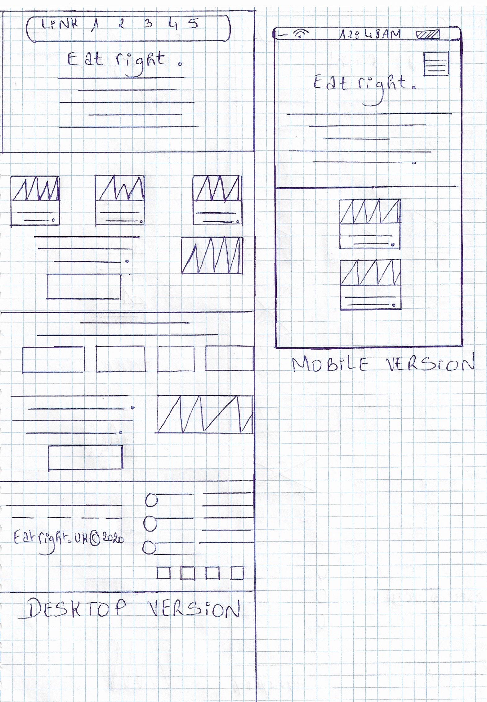
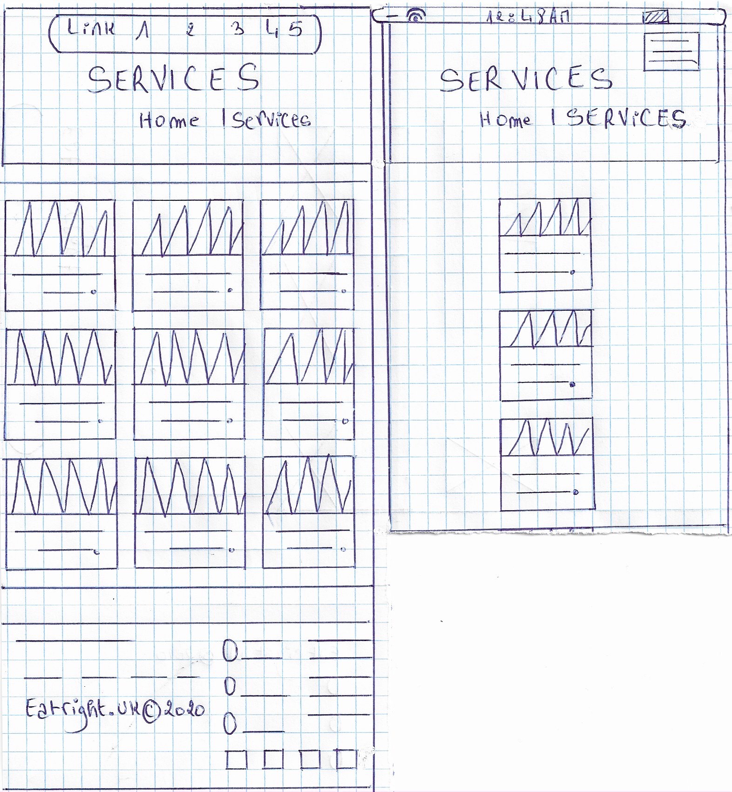
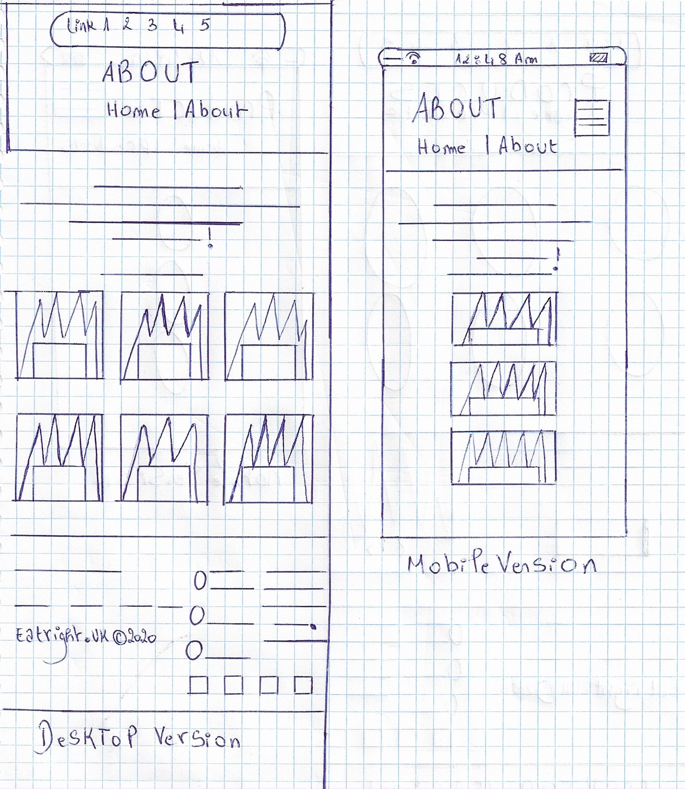
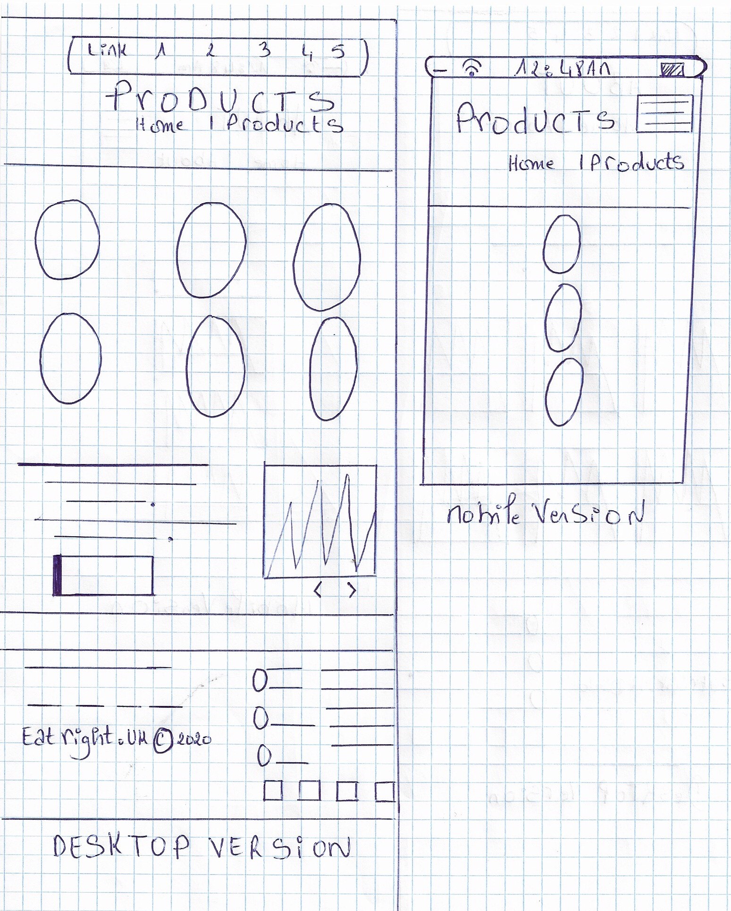
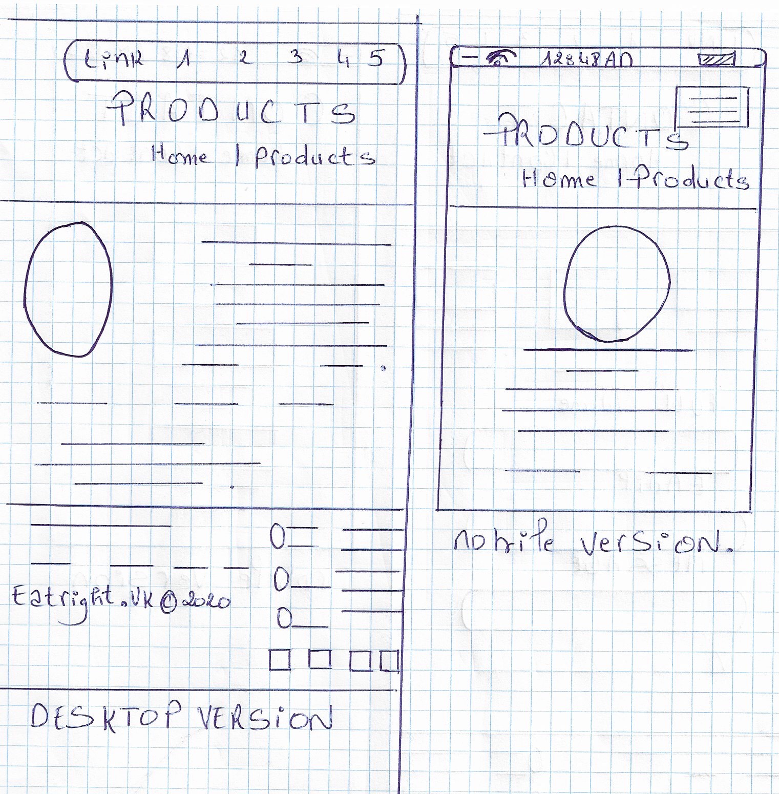
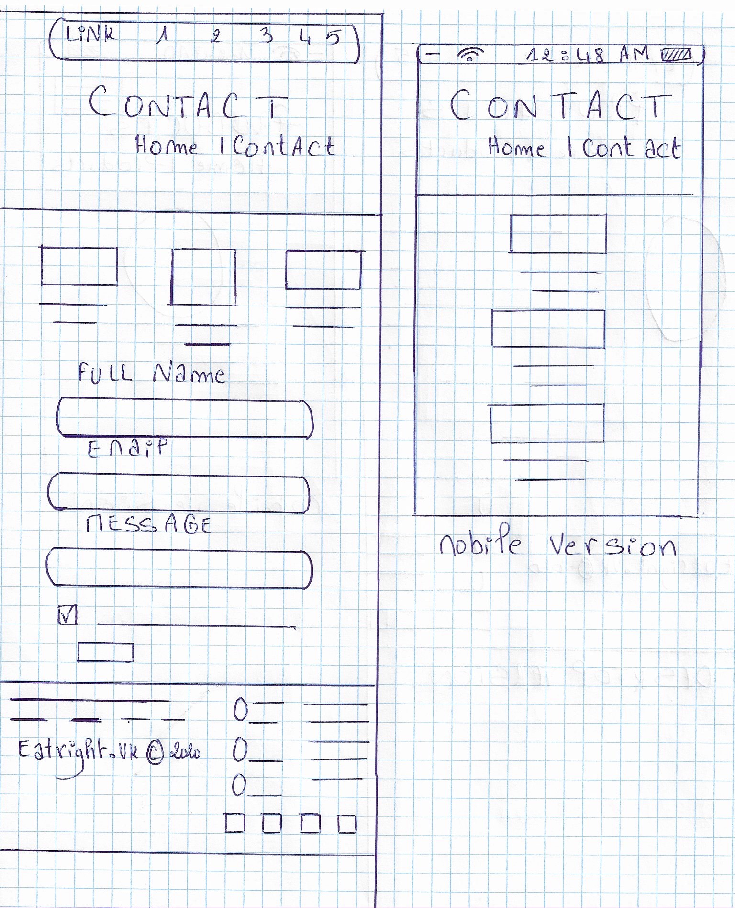

# Background
Eating healthy is something we all know we should do; But only few of us do. The purpose of this website is to try to make a difference by addressing this critical issue that deserves more public  attention; I believe that the fact that food plays a much larger role in overall body and brain health than we ever imagined is a strong reason that made me choose this topic; In Eatright you can find a range of foods that can be adapted to be a healthy option. The small act of reading the menu with awareness instead of focusing on the chips and burgers part can save a lot of Beneficeless calories. My main objective is to bring a healthy message and I have chosen to do this website as a way of investing and defending my concept. 

# Wire Frames

**Home Page**

**Services Page**

**About Us Page**

**Product Page**

**Product details Page**

**Contact Page**

# Colour choices
Colours are among the most powerful tools in the design of a website;  Choosing the right colour scheme is crucial to attain a high-quality website that is well-received by the viewers.
The colour combination of  my website focuses on white; Green and Black .
I used a lot of green( #8bce21; #9BB800 ; rgb(92, 223, 53)  rgb(91, 220, 52) ; #5bdc34 ); It is a pleasing colour to the human eye that symbolizes health and healing. This colour is the most suitable for my website that aims to spread positivity and gain people's trust.
The white colour(#fff) ,on my website is used to convey a feeling of purity and cleanliness to make our customers feel the reliability of our work  . 
The black colour (rgba(20, 21, 26, 0.6) ;#444 ;#000 ) is timeless and classic ;It gives a clean message of professionalism and formality; It is so powerful that I feel  it helps me in spreading my message and enhancing its importance as well as attracting people's attention by adding more focus on the text and improving its Readability.
I used the grey colour and grey shades (#ccc ,#d8d8d8, #8f9296, rgba(255, 255, 255, 0.6), rgba(159, 162, 177, 0.8), #83818) to symbolize modernity and add a formal and sophisticated touch in order to ensure a better view of my website. 
I included slightly the red colour( rgb(255,0,0) ).The red colour suggests attention-getting.
I intentionally used red to add  an energy and power effect to the page. I used  red for the product price, to emphasize the price-quality comparison and invite the customer to stop at it and realize that we have high quality products with reasonable  prices.

# Accessibility
Concerning the W3C accessibility standards,  I have taken many measures to conform it :
I insisted on providing sufficient contrast between foreground and background because some people are not able to read a text without the presence of adequate contrast between the background and the text ; Bright colours can hinder the website's quality because some users are not able to read bright colors and require low luminance.
I also made sure that form elements contain clearly associated labels by making sure that the fields in general have a descriptive label adjacent to the fields and placing labels to the left.
I included feedback that can be identified easily by alerting the users when they let a form uncompleted; This is done by using both error icon and background colour in order to make the error noticeable.
I tried to keep my content clear and precise, I wrote concise sentences and avoided useless information; The choice of images and icons was well-thought to make the meaning more comprehensible. 
I used headings and spacing to join associated content, reduce disorder and emphasize the content's relationships.
I made sure to write an adaptative code to the technology of the user by implementing responsive design to adjust the display to multiple zoom states and viewport sizes as on mobile devices , desktops and tablets.

# GDPR
For the GDPR I implemented a privacy policy text to my website that respects our needs and requirements as well as the 8 individual rights; I created an opt-in form in the contact page where I asked whether the customers want to receive news, tips & tricks on marketing from eatright.
The website pops up the following text for the visitor to inform him about our privacy policy then we let the choice for him; either to accept or decline :
"This website stores cookies on your computer. These cookies are used to provide more personalized service to you, both on this website and through other media. To find out more about the cookies we use, see our Privacy Policy.
If you click decline we won't track your information when you visit our site. But in order to comply with your preferences, we'll have to use just one tiny cookie so that you're not asked to make this choice again."

# Distance Selling
I do not sell anything online that derserves the distribution of distance selling acts.

# Evaluation
Eatright is a healthy food restaurant website that aims to make a difference and encourages people to change their eating style into a healthier one by introducing them to tasty healthy dishes. For this promotion, I created a home page that contains welcoming and motivational sentences in order to invite customers to discover us more, in addition to introducing them to our specific menus for customers who are dieting.

My Services page is dedicated to introduce our services from the delivery to our tasty morning menus .Besides, an About Us page introduces our lovely team from chef, cooks, waiters and a competent manager.
Our products page contains delicious dishes we serve, with quality images to show how they look like , if you click on a product this takes you to another page which is about the product details that shows the price, a short description and additional information about the product to make sure the customer is well informed. Contact Us page provides visitors with our contact details, the possibility to send us any enquiries because a successful business is based essentially on a good communication.

I faced some difficulties while building my website ; Choosing a suitable design took me a lot of thinking because I wanted to do my best to create an attractive and harmonic website that embodies my ideas and objectives and can please the visitors so that they want to discover more about my restaurant instead of leaving  the page; A successful website requires a lot of efforts and creativity.
To support my content I used high-quality images to capture the attention of the visitors, beautiful images act as both eye candy and informational tools and can trigger memories and all sorts of emotions and have a big impact on the user . I used background image as well to create a unique atmosphere on my site. 
Testing is no less important than other phases; I have used chrome DevTools to test my website on multiple devices, it is very useful in addition to being free to use.
I made sure that my website is responsive and adjusts for different-sized screens and viewports by testing it on multiple devices.

Like it or not, People do judge a book by its cover and if your website’s design is poor it can make them think the content is poor too. This is why your design should be well done so that you can get more people engaging with your content.
The right design elements are not a sudden choice, we should determine first who are we addressing , so that we can understand our customers more and know how the design should be made to fit the customer's expectations.
The very first step I did was to put clearly the concept of my website before even starting to design it. Eatright is my website's name, it aims to promote a restaurant of healthy food , it gives information about our specialties and services . Our objective is to spread a healthy message as we intend to grow and defend our concept.

The purpose of the website is to reveal seriousness and simplicity in addition to being attractive and please visitors, to represent well our professional work. All the website's elements from text to pictures should contribute in providing the best image of our restaurant and demonstrate our credibility because we deserve to be trusted. However, A well built design should reflect all of this. 
Secondly , building the design is also based on the target audience, It is clear that the target audience for my website will be made up of people who are adopting healthy eating style or those dieting so the website design must reflect healthy food theme.

I also relied on colour combination for my website design, Colours can spark different meanings this is why I combined friendly colours to increase the customer's trust, and influence his opinion to our favor; A customer who visits a bright blue and yellow website to discover a healthy food restaurant spreading a healthy message may feel that something is not right even if he cannot explain why.

